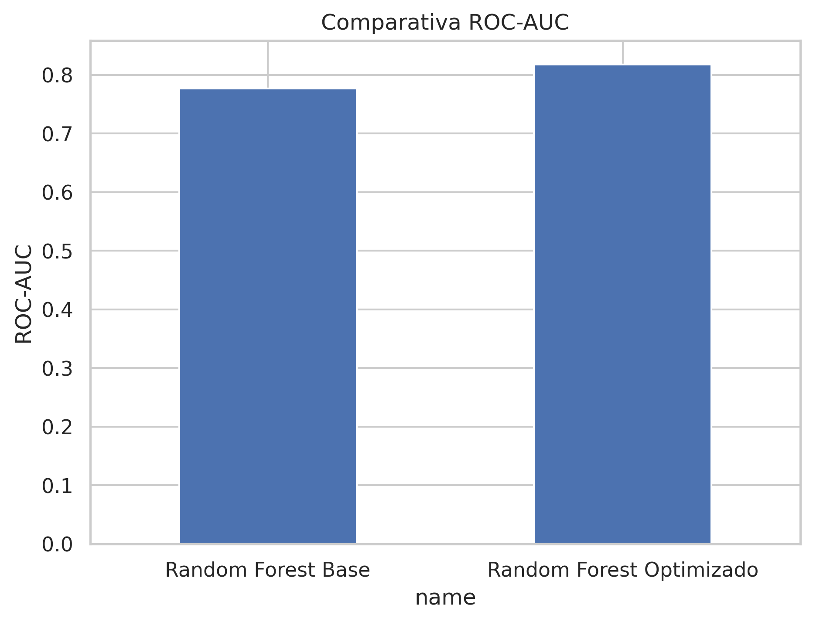
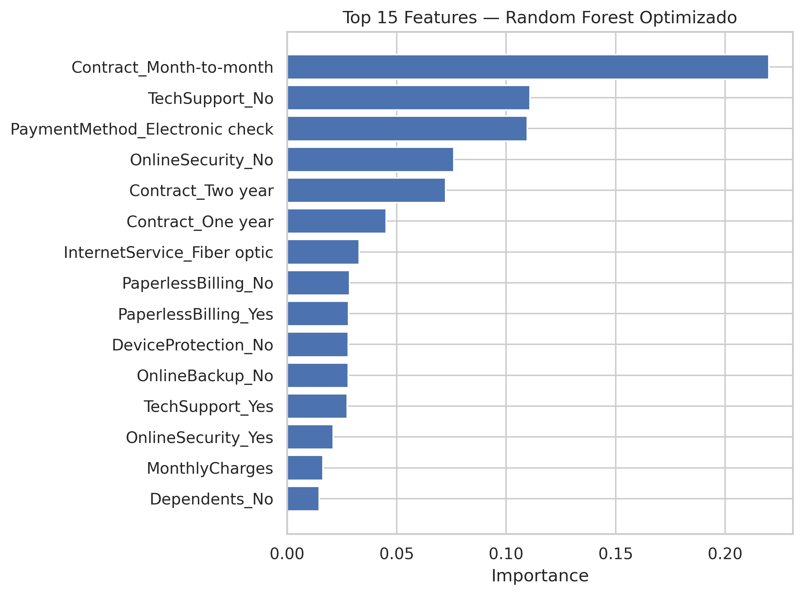
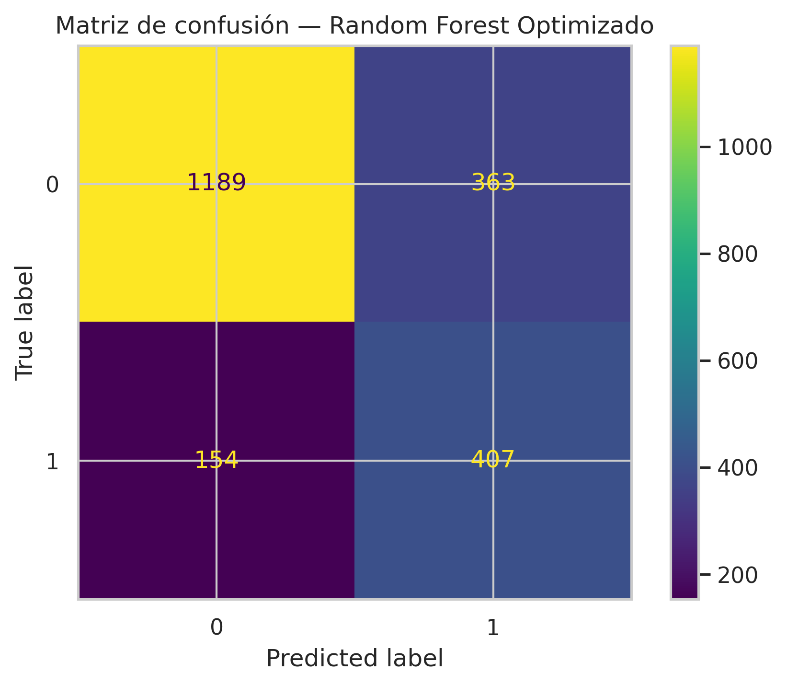

# 📌 Telecom X – Parte 2: Predicción de Cancelación (Churn)

## 🎯 Propósito del análisis
Este proyecto tiene como objetivo **predecir el churn (cancelación)** de clientes de **Telecom X** en base a variables relevantes.  
Se aplican técnicas de preparación de datos, análisis de correlación, selección de variables, balanceo de clases (*SMOTE*) y modelado predictivo con diferentes algoritmos de *Machine Learning*.

---

## 📂 Estructura del proyecto
```
telecomx-churn/
├── notebooks/
│   └── TelecomX_Parte2_Churn_EXT.ipynb   # Notebook principal (Colab-friendly)
├── requirements.txt                      # Dependencias
├── LICENSE
├── images/                                # Visualizaciones generadas
└── README.md
```

---

## 🚀 Ejecutar en Google Colab
[](https://colab.research.google.com/github/GabArg/telecomx-churn/blob/main/notebooks/TelecomX_Parte2_Churn_EXT.ipynb)

---

## 📥 Datos (públicos en Google Drive)
El dataset procesado `datos_tratados.csv` se encuentra disponible en Google Drive.

**Carga directa en Python:**
```python
import pandas as pd
csv_link = "https://drive.google.com/uc?export=download&id=1tZEzR9gKBlsL7UOgu5kmiCLCLoNCx2iL"
df = pd.read_csv(csv_link)
df.head()
```

---

## 🛠️ Preparación de los datos

- **Clasificación de variables:**
  - Categóricas: género, método de pago, tipo de contrato, etc.
  - Numéricas: tenure, monthly_charges, total_charges, etc.
- **Codificación:** *One-Hot Encoding* para variables categóricas.
- **Balanceo de clases:** *SMOTE* para igualar la proporción de clientes que cancelaron y no cancelaron.
- **Normalización:** aplicada para modelos sensibles a la escala (KNN, Regresión Logística).
- **Separación:** 80% entrenamiento y 20% prueba.

---

## 📊 Ejemplos de visualizaciones e insights

### Comparativa ROC-AUC


### Importancia de Variables


### Matriz de Confusión


---

## 🤖 Modelado y evaluación

Se entrenaron y evaluaron los siguientes modelos:
- Regresión Logística
- K-Nearest Neighbors (KNN)
- Árbol de Decisión
- Random Forest
- XGBoost

**Métricas utilizadas:**
- Accuracy
- Precision
- Recall
- F1-score
- ROC-AUC
- Matriz de confusión

**Resultado destacado:**  
El **Random Forest Optimizado** presentó la mejor métrica ROC-AUC (`0.81`), superando a los demás modelos.

---

## 📋 Instrucciones para ejecutar localmente
```bash
# 1. Clonar el repositorio
git clone https://github.com/GabArg/telecomx-churn.git
cd telecomx-churn

# 2. Instalar dependencias
pip install -r requirements.txt

# 3. Ejecutar el notebook
jupyter notebook notebooks/TelecomX_Parte2_Churn_EXT.ipynb
```

---

## 📜 Licencia
Este proyecto está bajo licencia MIT. Ver archivo [LICENSE](LICENSE) para más detalles.
